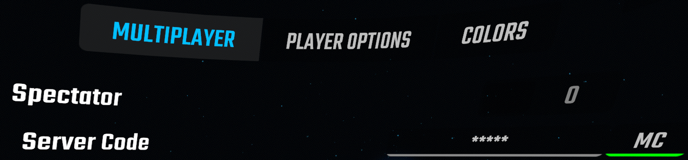

# [MultiCode-inator](https://clips.twitch.tv/WealthyHungryAppleBudStar-kwPAcoffd0CAUzdz)
Beat Saber mod which adds on screen text and a stream command for your multiplayer lobby code.

## Usage
### On Screen Text
The on screen text will appear whenever in a multiplayer lobby or game. Settings such as the text's size, colour, position and content can all be set from MultiCode-inator's settings.

Note: When setting the text use "{code}" to represent where the multiplayer lobby code should be on the text.
### Stream Command
After installation the commands **!multicode** and **!mc** will be added to your stream chat. When one of these commands are used in your stream chat, the code for your current multiplayer lobby will be posted.

MultiCode-inator can also post the current lobby code into your stream chat whenever you join a new multiplayer lobby.

MultiCode-inator's settings are accessible from a button to the right of the server code in the multiplayer setup panel.

## Installation
[Install](https://bsmg.wiki/pc-modding.html#install-mods) the latest version of [MultiCode-inator](https://github.com/Sirspam/MultiCode-inator/releases/latest) and the dependencies listed below.
### Dependencies
* [SiraUtil](https://github.com/Auros/SiraUtil) _- Available in ModAssistant_
* [BeatSaberMarkupLanguage](https://github.com/monkeymanboy/BeatSaberMarkupLanguage) _- Available in ModAssistant_
#### Optional Dependencies
_One of these broadcasters must be installed for MultiCode-inator's stream command to work_
* [CatCore](https://github.com/ErisApps/CatCore) (1.0.0+) _- Available in ModAssistant_
* [BeatSaberPlus](https://github.com/hardcpp/BeatSaberPlus) (5.0.0+)
## Contribution
Feel free to point out any suggestions or improvements to me by submitting a PR or contacting me on Discord ([Sirspam#7765](https://discordapp.com/users/232574143818760192)).
